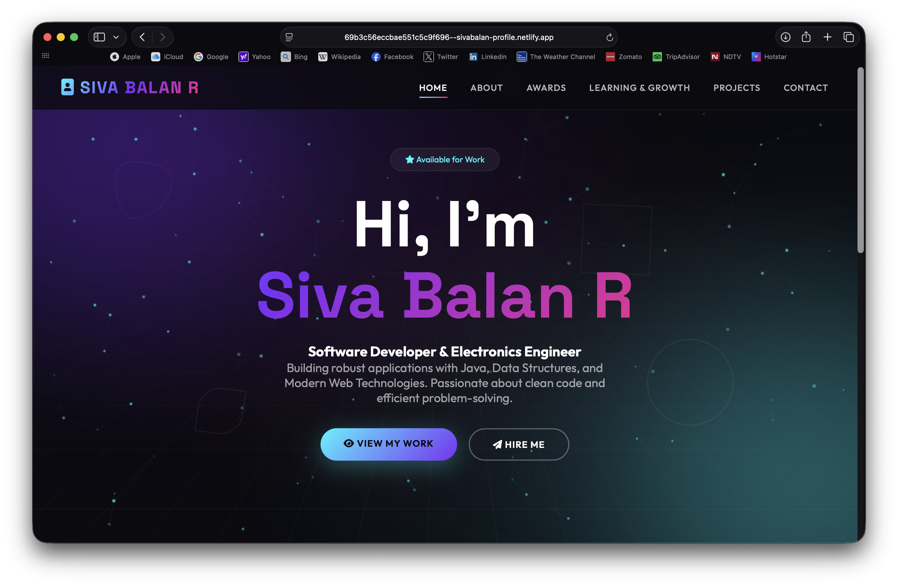

# 🌐 Siva Balan R – Portfolio Website

This repository contains the source code for my personal portfolio website.
The website showcases my projects, achievements, technical skills, and learning journey as an **Electronics and Communication Engineering student and developer**.

---

## 🚀 Live Website

👉 Visit my portfolio:
**https://sivabalan-profile.netlify.app**

---

## 👨‍💻 About Me

I am **Siva Balan R**, an Electronics and Communication Engineering student passionate about:

* Embedded Systems
* Software Development
* AI & Machine Learning
* Full Stack Development

I enjoy building innovative solutions and learning new technologies to solve real-world problems.

---

## 📂 Website Sections

The portfolio includes the following pages:

* **Home** – Introduction and overview
* **About** – Background and technical interests
* **Awards** – Achievements and recognitions
* **Learning & Growth** – Courses and certifications
* **Projects** – Projects I have developed
* **Contact** – Ways to reach me

---

## 🛠️ Technologies Used

* **HTML5**
* **CSS3**
* **JavaScript**
* **Font Awesome**
* **Google Fonts**
* **Netlify (Deployment)**

---

## ✨ Features

* Responsive design for desktop and mobile
* Animated background and particle effects
* Modern UI with gradient styling
* Interactive project cards
* Smooth navigation
* Mobile hamburger menu

---

## 📸 Preview

---

## 📬 Contact

If you would like to collaborate or have any questions, feel free to reach out:

📧 Email: [sivabalanr164@gmail.com](mailto:sivabalanr164@gmail.com)
📱 Phone: +91 6379826398

---

## 🔗 Connect With Me

* GitHub: https://github.com/siva-balan-1
* Portfolio: https://sivabalan-profile.netlify.app

---

⭐ If you like this project, consider giving it a **star**!
